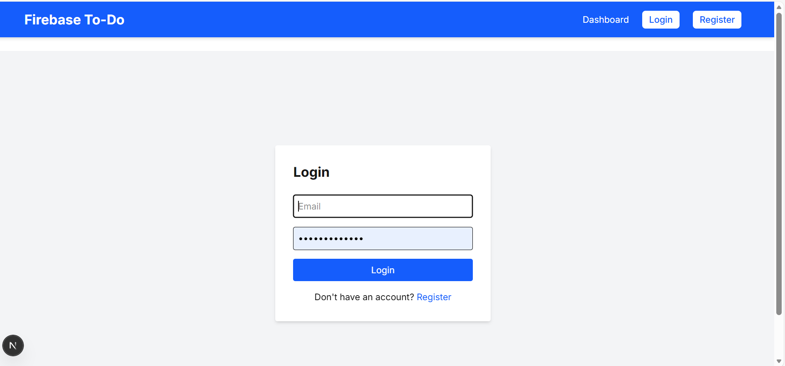

# Firebase CRUD To-Do App with Authentication

A Task Management App built with Next.js, TypeScript, Firebase Authentication, and Firestore.

## Features

- **Authentication**: Register and login with email/password
- **Protected Routes**: Only authenticated users can access the dashboard
- **CRUD Operations**: Create, Read, Update, and Delete tasks
- **User-specific Data**: Each user sees only their own tasks
- **Task Properties**: Title, description, priority (Low/Medium/High), and completion status

## Setup Instructions

1. **Install Dependencies**
   ```bash
   npm install
   ```

2. **Configure Firebase**
   - Create a Firebase project at [https://console.firebase.google.com](https://console.firebase.google.com)
   - Enable Email/Password authentication in Firebase Console
   - Create a Firestore database
   - Copy your Firebase config and update `.env.local` with your credentials

3. **Run the Development Server**
   ```bash
   npm run dev
   ```

4. **Access the App**
   - Open [http://localhost:3000](http://localhost:3000)
   - Register a new account
   - Login and start managing tasks

## Project Structure

```
src/
├── app/
│   ├── login/page.tsx          # Login page
│   ├── register/page.tsx       # Registration page
│   ├── page.tsx                # Dashboard with CRUD operations
│   └── layout.tsx              # Root layout
├── components/
│   └── Navbar.tsx              # Navigation with auth state
├── hooks/
│   └── useAuth.ts              # Custom hook for auth state
├── lib/
│   └── firebase.ts             # Firebase configuration
└── types/
    └── task.ts                 # Task interface

```

## Firestore Collection Structure

**Collection**: `tasks`

| Field       | Type    | Description                    |
|-------------|---------|--------------------------------|
| id          | string  | Auto-generated document ID     |
| title       | string  | Task title                     |
| description | string  | Task details                   |
| completed   | boolean | Completion status              |
| priority    | string  | "Low" \| "Medium" \| "High"    |
| userEmail   | string  | Email of the task owner        |

## Technologies Used

- Next.js 16
- TypeScript
- Firebase Authentication
- Firestore Database
- Tailwind CSS
## Screenshoot Image

register Image : 

dashbord Image : 

Home page Image :  ,  ,

firebase Image : , 

The github link : https://github.com/graceniyigena34/Firebase-CRUD-To-Do-App-with-Authentication.git
